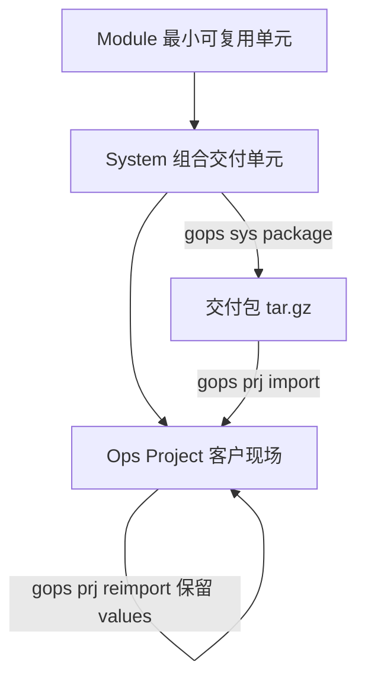
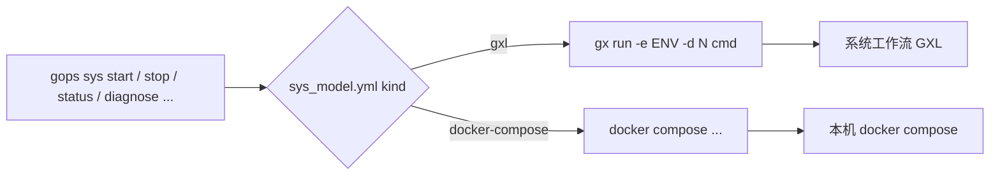
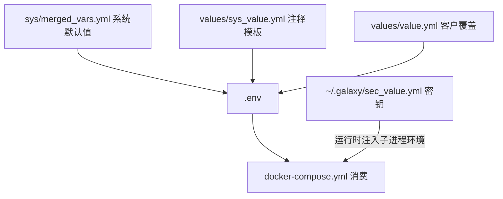

# GOps 定位与价值

## 一句话定位

`gops`（`galaxy-ops`）不是执行引擎，而是运维能力的**资产化 + 组合 + 交付**层：

> 把"一套系统交付给 N 个客户"变成有对象模型、有版本、可审计的工程流程。
> 执行本身仍然交给 `galaxy-flow`（`gx`）或本机 `docker compose`。

## 要解决的问题

这一节回答"为什么会有 `gops`"。这些问题最终都指向同一个主题：**交付中"该共享的"与"该隔离的"没有被分层表达**——能力、值、流程应沉淀到共享层，客户差异与运行形态应隔离到独立层；一旦混在一起，变更就会逃出版本与责任的闭环。

### 1. 客户环境的部署配置：时常修改、容易遗忘、后果严重

**客户环境下的部署配置，是运维交付长期的重灾区：**

- **时常修改**：客户环境异构、需求会变（扩容、换证书、换域名、合规），配置天生是"活的"。
- **容易遗忘**：修改发生在交付之后的现场，脱离产品版本库，没有"谁改了、改成了什么、相对默认差了多少"的记录。
- **后果严重**：配置直接驱动运行时，一个错值就是生产事故，而且往往没有回滚点。

#### 根因：配置的三种"脱节"

| 脱节 | 含义 |
| --- | --- |
| 时间脱节 | 配置在"交付之后、运行之中"被改，脱离了产品构建时刻 |
| 空间脱节 | 配置躺在客户环境中，脱离了产品的版本库 |
| 责任脱节 | 产品 / 实施 / 客户运维都可能改，却没人完整拥有 |

三种脱节合起来，就是"配置改动逃出了版本与责任闭环"。

#### GOps 的应对

| 症状 | 脱节 | GOps 机制 |
| --- | --- | --- |
| 时常修改 | 时间 | 分层值文件（`merged_vars` 默认 ⊕ `sys_value.yml` ⊕ `value.yml`），高频改动被收敛进受控差异层 |
| 容易遗忘 | 空间 | `sys_value.yml` 注释模板、`merged_vars.yml` 入库、`prj reimport` 保留 `values/` |
| 后果严重 | 责任 | 配置与密钥分离（`${SEC_xxx}` 运行时注入）、`diagnose` 预校验 + 掩码、打包产物版本化可回滚 |

一个关键设计：`values/sys_value.yml` 生成时为**整份注释模板**——"没写"等于"用系统默认值"。于是"复制了一份默认值却忘了改"这类经典事故从根上消失：要覆盖才写，且只写差异。

#### 边界

GOps 提供的是"让配置回到版本与责任闭环"的**结构**，但它不包办全部：

- 它**不强制**你把 `values/` 提交进 git——这仍是纪律（好在该提交的东西被压缩到极小、极明确）；
- 它**不做漂移检测**——有人绕过 `gops` 直接改现场文件，不会告警；
- **变更审计**依赖 git 提供历史。

换句话说，它把"需要人管的东西"从"整个客户环境"缩小到"几个值文件 + 一次 commit"。

### 2. 模块被聚合进多个系统：默认要能用、集成要能改、部署还要能再改

一个模块（如 `postgresql`）会被多个系统复用，而它的运行配置需要同时满足三件事：

- **默认设定**：模块自带一套能直接跑起来的默认值；
- **系统集成时可改写**：被某个系统聚合时，集成者能按该系统需要改写；
- **部署时再次修改**：到了客户现场，实施 / 客户还要能再改。

难点在于：把定制写进模块就会**污染共享资产**（又回到"每系统一份"的老路）；而且三层改写必须有明确优先级，还要区分"哪些值允许被改、哪些不允许"。

#### 根因：共享与定制的冲突 + 覆盖层级

- 模块是**共享资产**，被 N 个系统复用；但配置需求是**每个系统 / 每个客户各异**的。
- 改写点分布在三层，必须有单一、明确的优先级链。
- 并非所有值都该被改：有些是身份 / 常量（如 `app_name`），必须锁死。

#### GOps 的应对：变量 + 可变性 + 分层覆盖点

| 层级 | 拥有者 | 载体 | 作用 |
| --- | --- | --- | --- |
| 模块默认 | 模块定义者 | `mod/<model>/vars.yml` | 能直接运行的默认值 |
| 系统集成覆盖 | 系统集成者 | `sys/setting/vars.yml` → merge → `sys/merged_vars.yml` | 按系统需要改写 |
| 部署现场覆盖 | 实施 / 客户 | `values/sys_value.yml`、`values/value.yml` | 按客户环境再改 |

- **可变性（mutability）**：每个变量声明自己允许在哪些层被改——`Immutable` / `System` / `Module`。定义者用它划定"允许被改写的边界"（例如 `app_name` 声明为不可变）。部署时的交互式设置只遍历可变项。
- **共享复用**：模块以引用形式（`ModuleSpecRef`：名称 + 地址 + 模型 + 开关）被多个系统聚合，可改名、可选不同 `ModelSTD`，**无需改动模块本体**。

这样，同一模块的默认值只写一次，各系统 / 各客户的改写分别落在各自的层上，互不污染。

#### 边界

- 覆盖优先级的细节由运行时（`orion-variate` 的变量合并）决定，以实际行为为准；
- "哪些项该在系统层改、哪些该留给客户层"仍需约定，工具不强制。

### 3. 同一系统需要多种部署形态：二进制 / K8S / Docker Compose

同一套系统，可能既要在客户机上以**二进制**（裸机 / 进程）部署，又要上 **Kubernetes**，还要能跑 **Docker Compose**。

难点：三种形态**实现差异极大**（进程 vs 编排 vs 容器），几乎无法复用同一份部署脚本；如果每种形态各自维护一套交付（值文件、操作命令、打包流程），就等于**三份并行的运维体系**——问题 1 的"时常修改、容易遗忘"会被放大三倍。而客户差异（域名、端口、规格）本应与形态无关。

#### 根因：形态差异外溢成了交付体系的分叉

- 形态的差异本是**实现层**的（怎么落地），却扩散到了**交付层**（值、命令、打包）。
- 本应"一份值 + 一套命令"跨越三种形态，实际却变成三套。

#### GOps 的应对：分层表达形态

| 部署形态 | GOps 表达 | 执行者 |
| --- | --- | --- |
| 二进制（Host） | `kind: gxl` + `ModelSTD(RunSPC=Host)` | `gx` 执行模块的 host 工作流 |
| Kubernetes | `kind: gxl` + `ModelSTD(RunSPC=K8S)` | `gx` 执行模块的 k8s 工作流 |
| Docker Compose | `kind: docker-compose`（无 `ModelSTD`） | 本机 `docker compose` |

- **模块层承载"同一能力的多种落地形式"**：同一模块可同时拥有 Host 与 K8S 的 `mod/<model>/`（不同 `RunSPC`），各自的 `workflows/operators.gxl` 提供该形态的实现。
- **系统层选定形态**：`ModelSTD`（Host / K8S）+ `kind`（gxl / compose）决定用哪种形态交付。
- **三形态共享交付面**：同一套值模型、同一个命令面（`gops sys start/stop/status/diagnose`）、同一套打包 / 导入 / 保值流程。客户差异不随形态改变。

#### 边界

- 一个 `System` 绑定一个 `ModelSTD` + `kind`，**没有"一份系统自动产出三种形态"**；切换形态意味着另一个系统对象（但复用同一批模块与值定义）。
- GOps **不做形态间的语义转换**：不会把一份业务逻辑自动生成 host / k8s / compose 三份实现，各形态实现仍由模块作者分别编写；GOps 对齐的是**对象、值、命令与交付流程**，而非实现本身。

## 与开源机制的关系

"已经有 Helm / Ansible 了，为什么还要 GOps？"——先说结论：

> 开源机制解决的是"**怎么覆盖**"；GOps 想解决的是"**谁来覆盖、覆盖了什么、以及别忘了**"。前者是机制，后者是治理。

问题 2 拆成 7 个要求：R1 默认、R2 集成覆盖、R3 部署覆盖、R4 复用不 fork、R5 优先级链、R6 可变性、R7 记录保值。对照开源机制：

| 机制 | 复用 + 多层覆盖 | 优先级链 | 可变性声明 | 记录与保值 | 跨运行时 |
| --- | --- | --- | --- | --- | --- |
| Helm | ✅ chart 默认 + 覆盖 values | ✅ | ❌ | 🟡 升级可留用户 values | ❌ 绑 K8s |
| Kustomize | ✅ base + overlay | ✅ | ❌ | 🟡 靠 git | ❌ 绑 K8s |
| Ansible | ✅ role defaults + group/host vars | ✅ 20+ 级 | ❌ | ❌ | 🟡 通用但与执行耦合 |
| Terraform | ✅ module 变量 + tfvars | ✅ | ❌ | 🟡 state 非交付值 | ❌ 面向基础设施 |
| Nix modules | ✅ options + 覆盖 | ✅ | ✅ mkDefault/mkForce | 🟡 | ❌ 整机配置范式 |
| CUE / Jsonnet | ✅ 默认值 + 统一 | ✅ | 🟡 约束可禁覆盖 | ❌ | ❌ 是语言，不是交付系统 |

**开源已解决得很好的**：R1–R5（Helm 式分层 values、Ansible 式 role 复用）。GOps 的覆盖代数并不原创，本质与其同源。

**开源至今的四个空白**：

1. **可变性 ≠ 所有权边界**：开源工具把覆盖视为"谁在命令行传了什么"，没人把"产品 / 集成者 / 客户"表达成结构；Helm 里客户和集成者都只是传 `-f`，没有机制阻止客户覆盖集成者认为不可改的值。（只有 Nix 的 `mkDefault` / `mkForce` 把优先级做成了一等语义。）
2. **交付对象模型**：没有"系统 → N 个客户项目、各自维护客户值"的对象层。
3. **记录与保值**：没有工具原生提供"实际使用的值落盘入库 + 升级保护客户值"。
4. **跨运行时统一**：Helm / Kustomize 绑 K8s、Terraform 绑基础设施、Nix 绑整机，没有一套对象与覆盖链能在 host / k8s / docker compose 间共享。

**GOps 的位置（诚实版）**：

- 覆盖代数**不是原创**——可视为 Helm 式分层值 + Ansible 式复用的运维交付改写；
- 真正补的是空白 1–4：把覆盖嵌进 `Module → System → Ops Project` 对象模型、用 `Immutable` / `System` / `Module` 把可变性变成声明式所有权边界、用 `merged_vars.yml` + 来源追踪做记录、用 `kind` 跨运行时统一；
- 但它的可变性粒度比 Nix 粗（Nix 可对每个赋值定优先级并合并，GOps 按变量作用域分级），且闭环仍依赖 **git 纪律**。

## 有没有"满需求"的开源方案

把问题 1–3 合起来，"满需求"落在 6 个维度：

| 维度 | 含义 |
| --- | --- |
| D1 多层覆盖 | 默认 → 集成 → 部署三级覆盖 + 优先级链 + 复用不 fork |
| D2 可变性 / 所有权 | "某值不允许在某一层被改"作为声明 |
| D3 记录与保值 | 实际用了什么可复现；升级不覆盖客户值 |
| D4 密钥分离 | 密钥不落盘、运行时注入 |
| D5 多形态 | 同一能力支持二进制 / K8S / Compose |
| D6 交付对象模型 | 产品 → 系统 → 客户项目，含打包 / 导入闭环 |

主流方案对照：

| 方案 / 组合 | D1 | D2 | D3 | D4 | D5 | D6 |
| --- | --- | --- | --- | --- | --- | --- |
| Helm + GitOps(Argo/Flux) + SOPS | ✅ | ❌ | 🟡 | ✅ | ❌ 仅 K8s | 🟡 |
| Ansible + Vault / AWX | 🟡 过程式 | ❌ | ❌ | ✅ | 🟡 | ❌ |
| Terraform / Pulumi | 🟡 | ❌ | 🟡 state | 🟡 | 🟡 provider | ❌ |
| Nix / Colmena | ✅ | ✅ mkForce | 🟡 | 🟡 | 🟡 host 强 | ❌ |
| Crossplane | 🟡 | ❌ | 🟡 | 🟡 | 🟡 k8s 原生 | ❌ |
| Dagger | ❌ | ❌ | ❌ | 🟡 | 🟡 runner | ❌ |

**结论**：

1. **单一开源项目：没有满需求的。**
2. **K8s 单形态下最接近满需求的是 GitOps 栈**（Git + Helm/Kustomize + SOPS/Sealed-Secrets + Argo CD/Flux）：D1/D3/D4 都做到，甚至靠 reconcile 有了漂移检测；但 **D2 失守**（无可变性声明）、**D5 失守**（只服务 K8s）。
3. **能横跨三种形态的只有 Ansible / Terraform / Pulumi**，但它们是过程式 / 状态式的，没有 D6 对象模型，D2/D3 基本空白，且配置与执行耦合。
4. **跨形态没有开源方案同时满足**：要么绑死 K8s，要么退化成过程式的 Ansible。

GOps 自己也不是"满需求"：

| D1 | D2 | D3 | D4 | D5 | D6 |
| --- | --- | --- | --- | --- | --- |
| ✅ | ✅（粒度粗） | 🟡 靠 git 纪律 | ✅ | 🟡 需分别实现 | ✅ |

它缺 GitOps 那种"强制以 Git 为真源 + 漂移检测 + 对账回滚"，也不做形态间自动转换。准确说法：**开源里没有满需求，GOps 也没有；但它把"满需求"需要的维度装进了同一个对象模型，缺口集中在"强制入库 / 漂移检测 / 自动生成"。**

## GOps 与 GitOps 的差距

GOps 也依赖 Git，但 Git 在两边角色不同：

- **GitOps：Git 是控制回路的输入**——被常驻控制器持续读取、对账、收敛。
- **GOps：Git 是版本化的载体**——靠人 / CI 手动触发一次性动作。

一句话：**GitOps 的 Git 驱动一个 loop，GOps 的 Git 只是仓库。**

| 维度 | GitOps（Argo CD / Flux） | GOps |
| --- | --- | --- |
| Git 角色 | 控制回路输入（活） | 协作 / 版本载体（存） |
| 真源 | Git 是唯一真源，现场必须服从 | 分层：默认来自系统产物，差异来自 `values/`，现场不强制收敛 |
| 执行方式 | 常驻 controller 持续 reconcile | CLI 手动 / CI 一次性触发 |
| 部署语义 | 声明式终态（幂等 converge） | 可重复过程（gx workflow，未必终态） |
| 漂移检测 | 核心能力（OutOfSync → 自愈） | 无 |
| 回滚 | revert commit → 自动回滚 | 重跑部署（人工） |
| 多形态 | 主流绑 K8s | 二进制 / K8S / Compose（`kind`） |
| 密钥 | 加密后仍进 Git（SOPS / Sealed-Secrets） | 不进 Git、不落盘，运行时注入 |
| 对象粒度 | manifest / release / overlay | Module / System / Ops Project |

三个本质差距：

1. **有没有 reconcile loop**：GitOps 有常驻控制器持续把现场拉回 Git；GOps 没有任何常驻组件，`gops sys start` 跑完即止，**不知道现场是否偏离默认值**。
2. **部署能否归约为声明式终态**：GitOps 成立的前提是"期望状态可完整描述 + 幂等收敛"，这成立在容器 / 基础设施领域；二进制部署与 GXL 工作流走的是"可重复过程"，不假装是终态。
3. **真源的权威性**：GitOps 里现场是从属的，手改会被当 drift 冲掉；GOps 反而承认现场是权威之一——`prj reimport` 就是"重建系统、保留 `values/`"。两者哲学相反。

### 为什么二进制 / GXL 难以 GitOps 化

GitOps 需要四个前提同时成立，二进制 / host / GXL 恰好逐条违反：

| 前提 | 含义 | 二进制 / Host / GXL |
| --- | --- | --- |
| 终态可完整描述 | 期望状态是一个 spec | ❌ 安装 / 迁移是"过程 / 历史"（数据库迁移只能按序 apply） |
| 现实可观测 | 能读到实际状态并与期望 diff | ❌ host 没有统一的"部署了什么"状态接口，系统异构 |
| 操作幂等 | 可反复收敛而不产生副作用 | ❌ 启动 / 迁移 / 一次性初始化不幂等；GXL workflow 是"程序" |
| 资源可抛弃 | 收敛 = 杀掉重建 | ❌ 客户机器是有状态资产（数据 / license / 硬件），强收敛危险 |

同样是部署，Docker Compose 可以而 host 不行：

| 前提 | Docker Compose | 二进制 / Host |
| --- | --- | --- |
| 终态可完整描述 | ✅ `compose.yml` | ❌ 安装 / 迁移是过程 |
| 可观测 | ✅ `docker compose ps` | ❌ 无统一状态接口 |
| 幂等 | ✅ `up -d` 近似幂等 | ❌ 启动 / 迁移一次性 |
| 可抛弃 | ✅ 容器可重建 | ❌ 有状态资产 |

这也解释了为什么 GOps 的 `docker-compose` 形态最接近 GitOps——四个前提它占了三个半。

**但并非"绝对不可能"**：Puppet / Chef / Salt 证明了 host 收敛可行（装 agent + 状态模型 + 持续收敛），代价是 agent 重、OS 各异，且迁移 / 一次性步骤仍要退化成 `exec` / `unless` 这类逃逸阀。连 K8s 自己都得为非声明式步骤开逃逸阀（Helm hooks、Argo CD sync hooks、Job）——反过来说：凡是"过程"，GitOps 都得打补丁。

**所以 GOps 的选择是取舍**：既然四前提在二进制 / GXL 上凑不齐，就不去假装有终态收敛——部署 = 可重复的过程（GXL workflow），交给 `gx`；版本化的只是产物（tar.gz）+ 值（`values/`）；它**不承诺收敛，只承诺可复现与可追溯**。代价是失去漂移检测与自动回滚，换来的是形态自由。

**互补关系**更准确：GitOps 管"收敛"，GOps 管"组织与交付"；GitOps 在单形态里做到极致，GOps 用放弃收敛换来覆盖不可收敛的世界。

## 独特价值

### 1. 三层对象模型：复用与客户差异物理隔离

`Module → System → Ops Project` 三层各司其职：

- `Module`：最小可复用运维单元（变量 / 依赖 / 构件 / 工作流）。
- `System`：由模块组合出的交付单元。
- `Ops Project`：面向具体客户环境的运维项目。

同一个系统可以被多个客户项目导入，客户差异只落在 `<project>/values/<system>/`，不写死在系统定义里。



关键机制：在项目内的系统目录执行 `gops sys localize` / `sys update` 时，会依据上层 `ops-prj.yml` 反向解析出该项目为该系统维护的值目录，而不是使用系统自带的 `values/`。产品定义与客户现场在磁盘结构上天然分离。

### 2. 执行中立：同一命令面，两种后端

`sys/sys_model.yml` 的 `kind` 决定行为，但操作员的命令是同一套：



| `gops sys ...` | `gxl` 后端 | `docker-compose` 后端 |
| --- | --- | --- |
| `download` | `gx run download` | `docker compose pull` |
| `install` | `gx run install` | `docker compose create` |
| `start` | `gx run start` | `docker compose up -d` |
| `stop` | `gx run stop` | `docker compose stop` |
| `uninstall` | `gx run uninstall` | `docker compose down` |
| `status` | `gx run status` | `docker compose ps` |
| `diagnose` | `gx run diagnose` | `docker compose config` |

价值点：**纯声明式 compose 系统**（完全不依赖 `gx`）与**模块化 GXL 工作流系统**共享同一套创建、变量、打包、本地化、交付流程。

### 3. 多模型模块（ModelSTD）：一个模块，多目标平台

`ModelSTD = CpuArch × OsCPE × RunSPC`，例如 `x86-ubt22-k8s`、`arm-mac14-host`、`x86-ubt22-host`。`gops mod new` 一次生成全部目标模型目录，每个模型有独立的 `vars.yml` / `spec/` / `workflows/`。

即"一份模块定义，按 CPU / OS / 运行空间派生多套实现"，而不是为每个平台维护一个独立仓库。

### 4. 值分层 + "只写差异" + 可审计



- `.env = merged_vars 默认值 ⊕ values/sys_value.yml ⊕ values/value.yml`
- `sys update` 生成的 `values/sys_value.yml` 是**整份注释模板**：保持注释即"空覆盖"，取消注释才生效，默认值不会被钉死。
- 优先级明确：`value.yml`（客户覆盖） > `sys_value.yml`（系统值） > `merged_vars`（默认）。
- 来源可追踪：本地化会写出实际使用的值，能回答"这个最终值是谁给的"。

### 5. 密钥作为一等公民：不落盘、运行时注入、诊断掩码

compose 里用 `${SEC_xxx}` 占位；`gops sys start` 运行时从 `~/.galaxy/sec_value.yml`（或 `./.galaxy/sec_value.yml`）读取，只注入 **docker compose 子进程环境**，不写 `.env`、不入库；`gops sys diagnose`（`docker compose config`）注入的是掩码值 `********`。

配置与敏感值在生命周期上被彻底分开，而不是仅靠 `.gitignore` 约定。

### 6. 交付闭环：打包 → 导入 → 重导入保值

```text
gops sys package   -> <name>-<version>.tar.gz（先 update 解析变量）
gops prj import    -> 导入客户项目
gops prj reimport  -> 按 ops-prj.yml 重建系统，保留 values/ 客户值
```

`reimport` 体现了核心主张：**系统目录可被删除重建，但客户值永不丢失**。产品升级与客户现场数据成为两个独立生命周期。

### 7. 单体 CLI，无历史包袱

一个 `gops` 二进制覆盖 `mod` / `sys` / `prj`，不存在 `gmod` / `gsys` 的历史分裂；文档以当前代码实现为唯一真源。

## 与常见工具的边界

| 工具 | 主要职责 | 与 GOps 的差异 |
| --- | --- | --- |
| Ansible | 过程式配置与编排执行 | GOps 不执行；客户差异靠值文件而非 playbook 分支 |
| Helm | Kubernetes 包管理与模板 | GOps 跨 CPU / OS / 运行时，且含"系统 → 客户项目"对象层 |
| Terraform | 基础设施状态收敛 | GOps 不做状态收敛，面向运维交付资产 |
| docker compose | 单机声明式编排 | GOps 在其上加对象模型、打包、客户值、密钥、多模型 |

## 是 / 不是

**是**：运维能力的组织、配置、组合、交付；跨平台模块与系统的资产化；客户差异的集中管理。

**不是**：工作流执行引擎；配置管理 / 状态收敛工具。`kind: gxl` 系统的能力上限取决于 `galaxy-flow` / `gx`；`kind: docker-compose` 路径则把门槛降到"只要一台装了 docker 的机器"。

## 相关文档

- [维护器总览](./README.md)
- [系统维护器](./sys/README.md)
- [模块维护器](./mod/README.md)
- [`gops` 命令参考](../cmd/gops.md)
